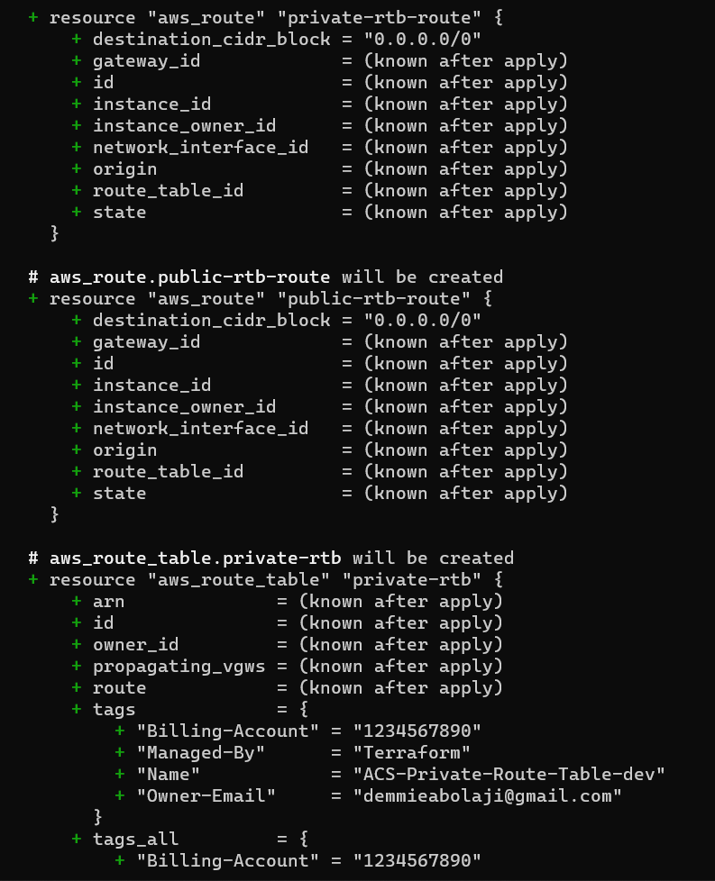
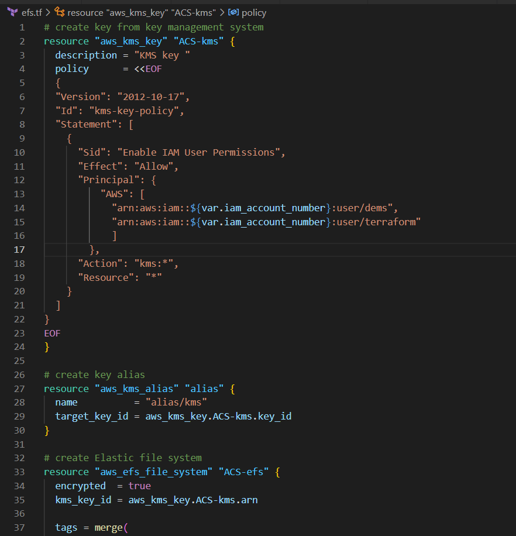
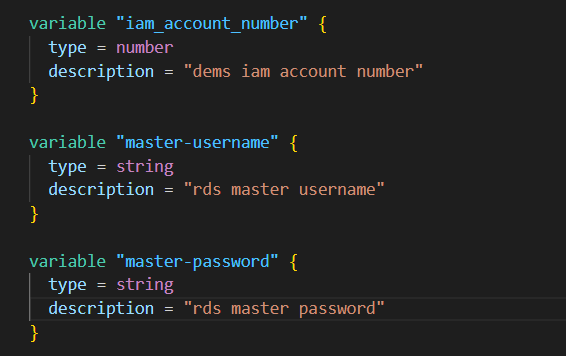
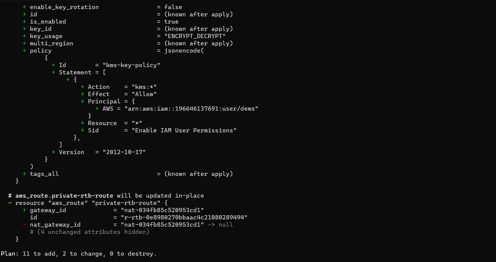
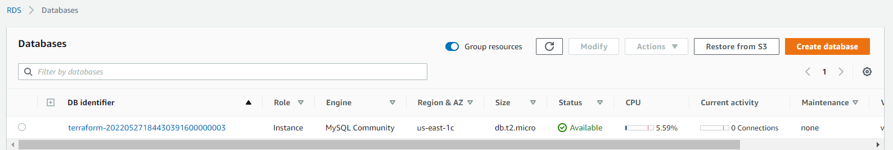

- created private and public subnets
- added the variables in the variables.tf file
- populated the information in tfvars file
- ran the terraform plan command to see what my output is

- added tags to the subnets
- populated the variables in tfvars and variables.tf
- ran the plan command to see the output

- created igw and nat-gateway resources
- added their tags
- populated the variables
- plotted a graph of the infrastructure
- ran the plan command 

- created private and public rtbs
- ran the terraform plan and apply command
- confirmed my resources were created

- created route53 hosted zones
- requested a certificate from aws certificate manager
- created internet facing and internal load balancers
- created security groups
- created target groups
- populated the variables in the necessary files
- ran the plan and apply command

- created nginx, webserver and bastion auto scaling group
- created their launch templates and target groups
- created bastion, wordpress, tooling, etc script files
- created roles for them
- populated the variables
- ran plan and apply command

- created efs file
- created rds
- generated kms key
- created rds subnet group and efs mount point
- populated the variables
- ran the plan and apply command 

